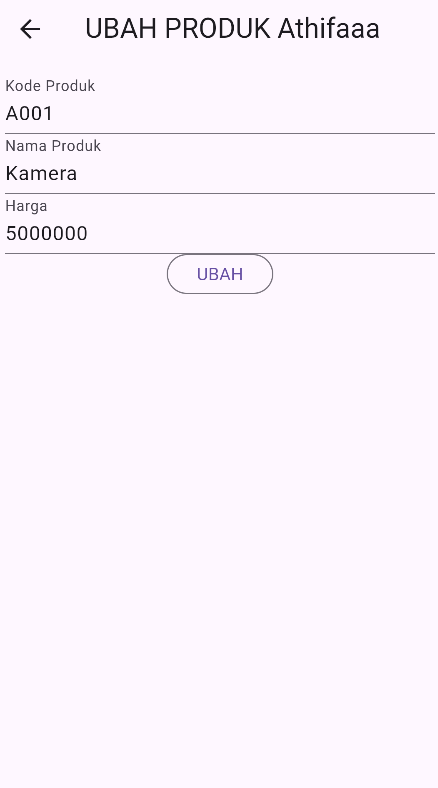

# TOKO KITA

**Nama**       : Athifa Nathania  
**NIM**        : H1D022031  
**Shift Baru** : F
**Shift Lama** : D

## TUGAS 4
## Screenshot Aplikasi Toko Kita
#### a. Halaman Login

#### b. Halaman Registrasi

#### c. Halaman List Produk

#### d. Halaman Detail Produk

#### e. Halaman Edit Produk

#### f. Halaman Tambah Produk

## TUGAS 5
## Penjelasan Aplikasi
### 1. Halaman Registrasi
Halaman ini digunakan pengguna untuk melakukan registrasi memasuki sistem
#### a. Form Registrasi

Pada gambar diatas dilakukan proses registrasi dengan menginputkan formulir registrasi yaitu nama, email, password, dan konfirmasi password. 
