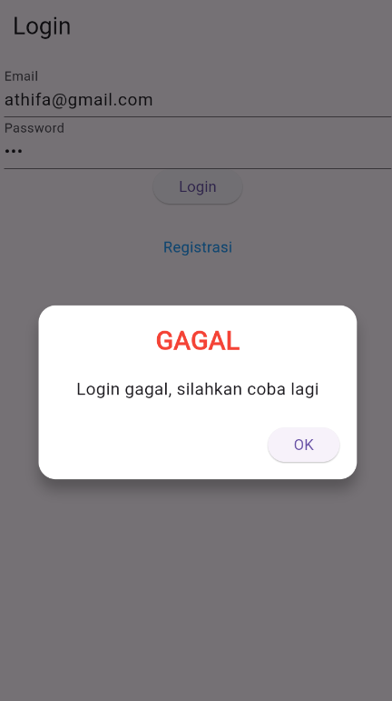

# TOKO KITA

**Nama**       : Athifa Nathania  
**NIM**        : H1D022031  
**Shift Baru** : F
**Shift Lama** : D

## TUGAS 4
## Screenshot Aplikasi Toko Kita
#### a. Halaman Login


#### b. Halaman Registrasi


#### c. Halaman List Produk


#### d. Halaman Detail Produk


#### e. Halaman Edit Produk


#### f. Halaman Tambah Produk


## TUGAS 5
## Penjelasan Aplikasi
### 1. Halaman Registrasi
Halaman ini digunakan pengguna untuk melakukan registrasi mendaftar ke sistem
#### a. Form Registrasi

Pada gambar diatas dilakukan proses registrasi dengan menginputkan formulir registrasi yaitu nama, email, password, dan konfirmasi password. 

```dart
void _submit() {
    _formKey.currentState!.save();
    setState(() {
      _isLoading = true;
    });

    RegistrasiBloc.registrasi(
      nama: _namaTextboxController.text,
      email: _emailTextboxController.text,
      password: _passwordTextboxController.text,
    ).then((value) {
      showDialog(
        context: context,
        barrierDismissible: false,
        builder: (BuildContext context) => SuccessDialog(
          description: "Registrasi berhasil, silahkan login",
          okClick: () {
            Navigator.pop(context);
          },
        ),
      );
    }, onError: (error) {
      showDialog(
        context: context,
        barrierDismissible: false,
        builder: (BuildContext context) => const WarningDialog(
          description: "Registrasi gagal, silahkan coba lagi",
        ),
      );
    });

    setState(() {
      _isLoading = false;
    });
  }
}
```

Kode di atas berfungsi untuk melakukan proses registrasi dengan mengambil input dari pengguna berupa nama, email, dan password melalui formulir. Saat tombol registrasi ditekan, fungsi `_submit()` akan dijalankan. Fungsi ini pertama-tama menyimpan input formulir menggunakan `FormState.save()`, lalu mengubah status `_isLoading` menjadi `true` untuk menunjukkan bahwa proses sedang berlangsung. Kemudian, data registrasi dikirim ke backend melalui metode `RegistrasiBloc.registrasi` yang akan melakukan HTTP POST ke endpoint API dengan mengirimkan data dalam bentuk JSON. Jika registrasi berhasil, dialog sukses akan ditampilkan kepada pengguna, dan jika gagal, dialog peringatan muncul. Setelah proses selesai, status `_isLoading` kembali diubah menjadi `false`. Perlu dicatat, meskipun dalam penjelasan disebutkan adanya konfirmasi password, potongan kode ini tidak menunjukkan adanya logika untuk memvalidasi kesesuaian password dan konfirmasi password.

#### b. Pop Up Sukses Registrasi

```dart
RegistrasiBloc.registrasi(
      nama: _namaTextboxController.text,
      email: _emailTextboxController.text,
      password: _passwordTextboxController.text,
    ).then((value) {
      showDialog(
        context: context,
        barrierDismissible: false,
        builder: (BuildContext context) => SuccessDialog(
          description: "Registrasi berhasil, silahkan login",
          okClick: () {
            Navigator.pop(context);
          },
        ),
      );
    }, onError: (error) {
      showDialog(
        context: context,
        barrierDismissible: false,
        builder: (BuildContext context) => const WarningDialog(
          description: "Registrasi gagal, silahkan coba lagi",
        ),
      );
    });

    setState(() {
      _isLoading = false;
    });
  }
}
```
Jika registrasi berhasil, maka 'SuccessDialog' akan muncul dengan pesan "Registrasi berhasil, silahkan login" seperti pada gambar di atas. Namun, jika terjadi kesalahan, sistem akan menampilkan 'WarningDialog' dengan pesan "Registrasi gagal, silahkan coba lagi". Pada bagian `RegistrasiBloc.registrasi`, data nama, email, dan password dikirim. Ketika proses registrasi berhasil, dialog sukses akan muncul dengan opsi untuk menutup dialog menggunakan `Navigator.pop`. Sebaliknya, jika terjadi error, dialog peringatan akan ditampilkan. Setelah itu, status `_isLoading` diubah kembali menjadi `false` untuk mengakhiri proses loading.

### 2. Halaman Login
Halaman ini digunakan pengguna untuk melakukan login memasuki sistem
#### a. Form Login

Pada halaman ini, pengguna dapat melakukan proses login dengan mengisi form login yang tersedia. Form tersebut mencakup input untuk email dan password yang wajib diisi oleh pengguna, seperti yang terlihat pada gambar di atas. Setelah mengisi form, pengguna dapat menekan tombol "Login" yang terletak di bawah form. Begitu tombol ditekan, sistem akan melakukan validasi untuk memastikan data yang dimasukkan memenuhi syarat. Jika validasi berhasil, fungsi `_submit()` akan dipanggil untuk melanjutkan proses. Pada fungsi `_buttonLogin()`, terdapat tombol ElevatedButton yang menjalankan validasi menggunakan `_formKey.currentState!.validate()`. Jika validasi berhasil dan status `_isLoading` adalah `false`, maka fungsi `_submit()` akan dipanggil.
```dart
Widget _buttonLogin() {
    return ElevatedButton(
      child: const Text("Login"),
      onPressed: () {
        var validate = _formKey.currentState!.validate();
        if (validate) {
          if (!_isLoading) _submit();
        }
      },
    );
  }
```
#### b. Gagal Login

Jika terdapat kesalahan pada data yang dimasukkan pengguna dalam form login, akan muncul popup peringatan dari 'WarningDialog()' dengan pesan "Login gagal, silahkan coba lagi". Ketika pengguna menekan tombol "OK" pada popup peringatan tersebut, popup akan ditutup.
```dart
} else {
        showDialog(
          context: context,
          barrierDismissible: false,
          builder: (BuildContext context) => const WarningDialog(
            description: "Login gagal, silahkan coba lagi",
          ),
        );
      }
```
#### c. Berhasil Login

Pada fungsi `_submit()`, `LoginBloc.login()` dipanggil untuk mengirimkan data email dari `_emailTextboxController` dan password dari `_passwordTextboxController` ke server menggunakan metode POST. Setelah menerima respons dari server, data tersebut diubah menjadi objek model Login melalui fungsi `fromJson`. Jika login berhasil dan respons server menunjukkan kode 200, token dan userID yang diterima dari server akan disimpan menggunakan `UserInfo()` untuk keperluan di masa mendatang. Selanjutnya, pengguna akan diarahkan ke halaman `ProdukPage()` dengan menggunakan `Navigator.pushReplacement`.
```dart
void _submit() {
    _formKey.currentState!.save();
    setState(() {
      _isLoading = true;
    });

    LoginBloc.login(
      email: _emailTextboxController.text,
      password: _passwordTextboxController.text,
    ).then((value) async {
      if (value.code == 200) {
        await UserInfo().setToken(value.token.toString());
        await UserInfo().setUserID(int.parse(value.userID.toString()));
        Navigator.pushReplacement(
          context,
          MaterialPageRoute(builder: (context) => const ProdukPage()),
        );
```
### 3. Halaman Tampil/List Produk
Halaman ini digunakan pengguna untuk melihat produk apa saja yang ada dalam sistem
#### a. Produk Page

```dart
body: FutureBuilder<List>(
        future: ProdukBloc.getProduks(),
        builder: (context, snapshot) {
          if (snapshot.hasError) print(snapshot.error);
          return snapshot.hasData
              ? ListProduk(
                  list: snapshot.data,
                )
              : const Center(
                  child: CircularProgressIndicator(),
                );
        },
      ),
    );
  }
}
```
Pada potongan kode ini, terdapat widget `FutureBuilder` yang digunakan untuk melakukan pemanggilan asinkron pada method `ProdukBloc.getProduks()`, yang mengembalikan daftar produk. Dalam builder `FutureBuilder`, jika terjadi kesalahan saat pengambilan data, kesalahan tersebut akan dicetak ke konsol. Jika snapshot memiliki data, maka widget `ListProduk` akan ditampilkan dengan mengoper daftar produk yang diterima. Jika data belum tersedia, widget `CircularProgressIndicator` ditampilkan di tengah layar untuk menandakan bahwa proses pengambilan data masih berlangsung.

```dart
class ListProduk extends StatelessWidget {
  final List? list;
  const ListProduk({Key? key, this.list}) : super(key: key);
  @override
  Widget build(BuildContext context) {
    return ListView.builder(
        itemCount: list == null ? 0 : list!.length,
        itemBuilder: (context, i) {
          return ItemProduk(
            produk: list![i],
          );
        });
  }
}
```
Pada class `ListProduk`, widget ini merupakan stateless widget yang menerima parameter `list`, yang merupakan daftar produk. Dalam method `build`, widget ini menggunakan `ListView.builder` untuk membuat daftar item produk. `itemCount` diatur berdasarkan panjang daftar, dan `itemBuilder` digunakan untuk membangun setiap item dalam daftar dengan memanggil widget `ItemProduk`, yang menerima produk individu dari daftar sebagai parameter.

```dart
class ItemProduk extends StatelessWidget {
  final Produk produk;
  const ItemProduk({Key? key, required this.produk}) : super(key: key);
  @override
  Widget build(BuildContext context) {
    return GestureDetector(
      onTap: () {
        Navigator.push(
            context,
            MaterialPageRoute(
                builder: (context) => ProdukDetail(
                      produk: produk,
                    )));
      },
      child: Card(
        child: ListTile(
          title: Text(produk.namaProduk!),
          subtitle: Text(produk.hargaProduk.toString()),
        ),
      ),
    );
  }
}
```
Class `ItemProduk` adalah stateless widget yang menampilkan informasi dari objek `Produk`. Dalam method `build`, widget ini menggunakan `GestureDetector` untuk mendeteksi ketukan pada item produk. Ketika item diketuk, pengguna akan diarahkan ke halaman `ProdukDetail`, dan produk yang dipilih akan diteruskan sebagai parameter. Di dalam widget `Card`, terdapat widget `ListTile` yang menampilkan nama produk sebagai judul dan harga produk sebagai subjudul, memberikan informasi yang jelas dan terstruktur kepada pengguna.

### b. Pengambilan Data dari API
Seperti yang telah dijelaskan sebelumnya, pengambilan data dilakukan melalui fungsi `ProdukBloc.getProduks()`. Fungsi ini mengirimkan permintaan GET ke API untuk mendapatkan data produk. Setiap produk yang diterima dari API akan diubah menjadi objek `Produk` menggunakan metode `fromJson()` pada model `Produk`.

```dart
List<dynamic> listProduk = (jsonObj as Map<String, dynamic>)['data'];
```

### c. Menampilkan Data dari API
Untuk menampilkan daftar produk, digunakan widget `ListProduk`, di mana data produk akan ditampilkan dengan `ListView.builder()`. Properti `itemCount` digunakan untuk menentukan jumlah produk yang ditampilkan berdasarkan panjang daftar produk yang diperoleh dari API. Sedangkan `itemBuilder` bertanggung jawab untuk menampilkan setiap produk dengan memanggil komponen `ItemProduk()`, yang menampilkan nama dan harga produk.

```dart
Widget build(BuildContext context) {
    return ListView.builder(
        itemCount: list == null ? 0 : list!.length,
        itemBuilder: (context, i) {
          return ItemProduk(
            produk: list![i],
          );
        });
  }
```

Setelah itu, jika pengguna mengetuk salah satu produk dalam daftar, sistem akan mengarahkan pengguna ke halaman detail produk menggunakan `Navigator.push()`.

### 4. Halaman Detail Produk
Halaman ini digunakan pengguna untuk melihat detail produk yang dipilih
#### a. Produk Page

Kelas `ProdukDetail` menerima objek `Produk` sebagai parameter dan menampilkan informasi terkait produk tersebut, seperti kode, nama, dan harga.
**- Menampilkan Detail Produk**
```dart
@override
Widget build(BuildContext context) {
  return Scaffold(
    appBar: AppBar(
      title: const Text('Detail Produk'),
    ),
    body: Center(
      child: Column(
        children: [
          Text("Kode : ${widget.produk!.kodeProduk}", style: const TextStyle(fontSize: 20.0)),
          Text("Nama : ${widget.produk!.namaProduk}", style: const TextStyle(fontSize: 18.0)),
          Text("Harga : Rp. ${widget.produk!.hargaProduk.toString()}", style: const TextStyle(fontSize: 18.0)),
          _tombolHapusEdit()
        ],
      ),
    ),
  );
}
```
Dalam method `build`, halaman diatur dengan `Scaffold`, yang terdiri dari `AppBar` untuk judul dan `body` yang menampilkan informasi produk. Informasi seperti kode produk, nama produk, dan harga ditampilkan menggunakan widget `Text`, dan memanggil method `_tombolHapusEdit()` untuk menampilkan tombol edit dan hapus.

### 5. Halaman Tambah Produk
Halaman ini digunakan pengguna untuk menambahkan data produk 
#### a. Form Tambah Produk

**- Tombol Submit**
```dart
Widget _buttonSubmit() {
  return OutlinedButton(
    child: Text(tombolSubmit),
    onPressed: () {
      var validate = _formKey.currentState!.validate();
      if (validate) {
        if (!_isLoading) {
          if (widget.produk != null) {
            // kondisi update produk
            ubah();
          } else {
            // kondisi tambah produk
            simpan();
          }
        }
      }
    },
  );
}
```
Pada potongan kode ini, terdapat sebuah tombol yang berfungsi sebagai tombol submit. Ketika tombol ditekan, sistem akan melakukan validasi terhadap form menggunakan `_formKey.currentState!.validate()`. Jika validasi berhasil dan tidak sedang dalam proses loading, sistem akan memeriksa apakah objek `produk` ada. Jika ada, berarti pengguna ingin melakukan pembaruan data produk, sehingga metode `ubah()` akan dipanggil. Jika tidak ada, maka pengguna akan menambahkan produk baru, dan metode `simpan()` akan dipanggil.

**- Fungsi Simpan**
```dart
simpan() {
  setState(() {
    _isLoading = true;
  });
  Produk createProduk = Produk(id: null);
  createProduk.kodeProduk = _kodeProdukTextboxController.text;
  createProduk.namaProduk = _namaProdukTextboxController.text;
  createProduk.hargaProduk = int.parse(_hargaProdukTextboxController.text);
  ProdukBloc.addProduk(produk: createProduk).then((value) {
    Navigator.of(context).push(MaterialPageRoute(
        builder: (BuildContext context) => const ProdukPage()));
  },
```
Fungsi `simpan()` bertanggung jawab untuk menyimpan produk baru. Pertama, status loading diaktifkan dengan `setState()`. Kemudian, objek `Produk` baru dibuat dengan `id` diatur ke `null`. Data produk diambil dari controller teks yang ada dan disimpan dalam objek `createProduk`. Selanjutnya, metode `ProdukBloc.addProduk()` dipanggil untuk mengirim data produk baru ke backend. Jika permintaan berhasil, pengguna diarahkan ke halaman `ProdukPage()`.

**- Penanganan Kesalahan**
```dart
}, onError: (error) {
  showDialog(
    context: context,
    builder: (BuildContext context) => const WarningDialog(
      description: "Simpan gagal, silahkan coba lagi",
    ),
  );
});
```
Dalam potongan kode ini, jika terjadi kesalahan saat menyimpan produk baru, dialog peringatan akan muncul dengan pesan "Simpan gagal, silahkan coba lagi". Ini memberikan umpan balik langsung kepada pengguna mengenai kegagalan penyimpanan dan menyarankan mereka untuk mencoba lagi. Dialog ini membantu meningkatkan pengalaman pengguna dengan memberikan informasi yang jelas tentang apa yang salah.

#### b. Penyimpanan Server
Fungsi `addProduk()` yang terdapat dalam `produk_bloc.dart` memiliki peran penting dalam mengirimkan data produk baru ke server API. Variabel `apiUrl` menyimpan alamat URL API yang digunakan untuk menambah produk baru. Selanjutnya, `body` digunakan untuk mengemas data produk yang akan dikirim ke server dalam format JSON. Fungsi ini kemudian menggunakan metode POST untuk mengirim data ke endpoint API, dan menunggu respon dari server untuk menentukan apakah proses penyimpanan berhasil atau tidak.
```dart
static Future addProduk({Produk? produk}) async {
    String apiUrl = ApiUrl.createProduk;

    var body = {
      "kode_produk": produk!.kodeProduk,
      "nama_produk": produk.namaProduk,
      "harga": produk.hargaProduk.toString()
    };

    var response = await Api().post(apiUrl, body);
    var jsonObj = json.decode(response.body);
    return jsonObj['status'];
}
```
Dalam potongan kode di atas, fungsi `addProduk()` menerima parameter berupa objek `Produk`. Setelah menentukan URL API, ia menyusun objek `body` yang berisi informasi produk. Kemudian, fungsi `post()` pada objek `Api` digunakan untuk mengirimkan permintaan ke server. Respon yang diterima kemudian diubah menjadi format JSON dan statusnya dikembalikan untuk menunjukkan hasil dari operasi penyimpanan tersebut.

### 6. Proses Edit Produk
Halaman ini digunakan pengguna untuk mengedit produk yang dipilih
#### a. Form Edit

Berikut adalah parafrase penjelasan untuk setiap potongan kode yang disertakan.
**- Navigasi ke Halaman Edit**
```dart
OutlinedButton(
  child: const Text("EDIT"),
  onPressed: () {
    Navigator.push(
      context,
      MaterialPageRoute(
        builder: (context) => ProdukForm(
          produk: widget.produk!,
        ),
      ),
    );
  },
)
```
Ketika pengguna menekan tombol "EDIT", aplikasi akan mengarahkan pengguna ke halaman `ProdukForm()`, sambil mengirimkan data produk yang akan diedit sebagai parameter. Hal ini memungkinkan pengguna untuk melihat dan mengedit detail produk yang dipilih.

**- Memeriksa Mode Edit atau Tambah**
```dart
isUpdate() {
  if (widget.produk != null) {
    setState(() {
      judul = "UBAH PRODUK";
      tombolSubmit = "UBAH";
      _kodeProdukTextboxController.text = widget.produk!.kodeProduk!;
      _namaProdukTextboxController.text = widget.produk!.namaProduk!;
      _hargaProdukTextboxController.text = widget.produk!.hargaProduk.toString();
    });
  } else {
    judul = "TAMBAH PRODUK";
    tombolSubmit = "SIMPAN";
  }
}
```
Metode `isUpdate()` digunakan untuk memeriksa apakah ada data produk yang diterima dari halaman sebelumnya. Jika ada, aplikasi akan mengatur judul halaman menjadi "UBAH PRODUK" dan tombol submit menjadi "UBAH". Data produk akan diisi ke dalam kontrol teks yang sesuai, sehingga pengguna dapat melihat informasi yang akan diedit. Jika tidak ada data produk yang diterima, judul akan diatur menjadi "TAMBAH PRODUK" dan tombol submit menjadi "SIMPAN".

**- Proses Pembaruan Produk**
```dart
ubah() {
  setState(() {
    _isLoading = true;
  });
  Produk updateProduk = Produk(id: widget.produk!.id!);
  updateProduk.kodeProduk = _kodeProdukTextboxController.text;
  updateProduk.namaProduk = _namaProdukTextboxController.text;
  updateProduk.hargaProduk = int.parse(_hargaProdukTextboxController.text);
  ProdukBloc.updateProduk(produk: updateProduk).then((value) {
    Navigator.of(context).push(MaterialPageRoute(
        builder: (BuildContext context) => const ProdukPage()));
  }, onError: (error) {
    showDialog(
      context: context,
      builder: (BuildContext context) => const WarningDialog(
        description: "Permintaan ubah data gagal, silahkan coba lagi",
      ),
    );
  });
  setState(() {
    _isLoading = false;
  });
}
```
Fungsi `ubah()` dipanggil saat pengguna menekan tombol "Ubah" setelah mengisi formulir edit. Di sini, status loading diaktifkan, dan objek `Produk` baru dibuat berdasarkan data yang diisi oleh pengguna. Data produk yang telah diperbarui dikirim ke backend menggunakan `ProdukBloc.updateProduk()`. Jika pembaruan berhasil, pengguna diarahkan kembali ke halaman `ProdukPage`. Jika pembaruan gagal, pesan kesalahan ditampilkan melalui `WarningDialog`. Status loading kemudian dimatikan setelah proses selesai.

**Produk Berhasil di Edit**


### 7. Proses Hapus Produk
Ini digunakan pengguna untuk menghapus produk yang dipilih
#### a. Konfirmasi Hapus

```dart
OutlinedButton(
  child: const Text("DELETE"),
  onPressed: () => confirmHapus(),
)
```
Pada halaman detail produk, terdapat tombol "DELETE" yang memungkinkan pengguna untuk menghapus data produk. Ketika tombol ini ditekan, metode `confirmHapus()` akan dipanggil untuk menampilkan dialog konfirmasi, yang bertujuan untuk memastikan apakah pengguna benar-benar ingin menghapus data tersebut. Ini memberikan kesempatan kepada pengguna untuk mempertimbangkan kembali sebelum melakukan tindakan penghapusan.

**- Konfirmasi Penghapusan**
```dart
void confirmHapus() {
  AlertDialog alertDialog = AlertDialog(
    content: const Text("Yakin ingin menghapus data ini?"),
    actions: [
      OutlinedButton(
        child: const Text("Ya"),
        onPressed: () {
          ProdukBloc.deleteProduk(id: int.parse(widget.produk!.id! as String)).then(
              (value) => {
                    Navigator.of(context).push(MaterialPageRoute(builder: (context) => const ProdukPage()))
                  }, 
              onError: (error) {
            showDialog(
                context: context,
                builder: (BuildContext context) => const WarningDialog(
                      description: "Hapus gagal, silahkan coba lagi",
                    ));
          });
        },
      ),
      OutlinedButton(
        child: const Text("Batal"),
        onPressed: () => Navigator.pop(context),
      )
    ],
  );
  showDialog(builder: (context) => alertDialog, context: context);
}
```
Method `confirmHapus()` menampilkan dialog konfirmasi penghapusan dengan `AlertDialog`. Jika pengguna menekan "Ya", produk akan dihapus dengan memanggil `ProdukBloc.deleteProduk()`, dan pengguna akan diarahkan kembali ke halaman `ProdukPage`. Jika terjadi kesalahan saat penghapusan, akan muncul `WarningDialog` dengan pesan error. Jika pengguna menekan "Batal", dialog akan ditutup tanpa melakukan tindakan lebih lanjut.

**Produk Berhasil di Hapus**


### 8. Proses Logout
Ini digunakan pengguna untuk keluar dari sistem
#### a. Tombol Logout

Pada halaman List Produk, terdapat menu samping (side menu) yang menyertakan opsi untuk logout. Dengan memanfaatkan widget `Drawer`, pengguna dapat memilih fitur logout yang akan memanggil fungsi `LogoutBloc.logout()` untuk menghapus informasi pengguna yang tersimpan. Setelah logout berhasil, pengguna akan diarahkan kembali ke halaman login.
```dart
drawer: Drawer(
          child: ListView(
            children: [
              ListTile(
                title: const Text('Logout'),
                trailing: const Icon(Icons.logout),
                onTap: () async {
                  await LogoutBloc.logout().then((value) => {
                        Navigator.of(context).pushAndRemoveUntil(
                            MaterialPageRoute(
                                builder: (context) => LoginPage()),
                            (route) => false)
                      });
                },
              )
            ],
          ),
        ),
```
Dalam potongan kode di atas, menu logout ditampilkan sebagai `ListTile` di dalam `Drawer`. Ketika pengguna mengetuk opsi logout, fungsi `LogoutBloc.logout()` dipanggil untuk menghapus informasi pengguna. Setelah itu, pengguna akan diarahkan ke halaman login dengan menggunakan `Navigator.of(context).pushAndRemoveUntil()`, yang memastikan semua rute sebelumnya dihapus dari tumpukan navigasi.

#### b. onTap
Pada bagian ini, ketika pengguna menekan opsi logout di menu samping, fungsi `onTap` akan memanggil metode `LogoutBloc.logout()`. Setelah logout berhasil, pengguna akan diarahkan kembali ke halaman login dengan menghapus semua rute sebelumnya dari tumpukan navigasi. Ini memastikan bahwa pengguna tidak dapat kembali ke halaman yang memerlukan autentikasi setelah logout.
```dart
onTap: () async {
  await LogoutBloc.logout().then((value) => {
    Navigator.of(context).pushAndRemoveUntil(
        MaterialPageRoute(builder: (context) => LoginPage()),
        (route) => false)
  });
},
```

#### c. LogoutBloc Class
Class `LogoutBloc` bertanggung jawab untuk mengelola proses logout. Di dalamnya terdapat metode statis `logout()` yang akan memanggil metode `logout()` dari kelas `UserInfo`, yang menangani penghapusan informasi pengguna.

```dart
import 'package:tokokita/helpers/user_info.dart';

class LogoutBloc {
  static Future logout() async {
    await UserInfo().logout();
  }
}
```

#### d. UserInfo.logout() Method
Metode `logout()` dalam kelas `UserInfo` bertanggung jawab untuk menghapus semua data yang disimpan dalam `SharedPreferences`. Dengan menggunakan `pref.clear()`, semua informasi pengguna yang tersimpan akan dihapus, memastikan bahwa tidak ada data sisa yang tertinggal setelah pengguna keluar.

```dart
Future logout() async {
  final SharedPreferences pref = await SharedPreferences.getInstance();
  pref.clear();
}
```

Secara keseluruhan, ketiga potongan kode ini bekerja sama untuk memastikan bahwa ketika pengguna melakukan logout, semua data terkait pengguna dihapus dan pengguna diarahkan kembali ke halaman login.
